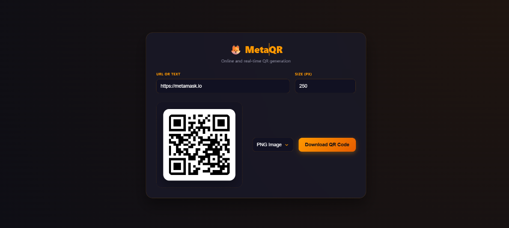

# 🦊 MetaQR - Simple QR Code Generator

MetaQR is a simple and beautiful QR Code Generator with a dark crypto-style design. 

This project is built using basic web files (HTML, CSS, and JavaScript) to make it **extremely easy for beginners to read, understand, and study**.

🚀 **Live Demo:** [https://qrcode-gen-bydk.netlify.app/](https://qrcode-gen-bydk.netlify.app/)

---

## 🎨 Visual Preview

---

## 🚀 Easy Features

- **⚡ Real-Time Updates** – As you type in the text box, the QR code updates instantly.
- **📐 Custom Size** – Adjust the height and width of the QR code using the size input box.
- **💾 Fast Downloads** – Download your QR code directly as a **PNG Image** or save it as a **PDF Document** with one click.
- **🦊 Crypto Theme** – Styled with a sleek, dark-orange layout inspired by crypto wallets.

---

## 📂 Project Files Explained (For Beginners)

Here are the 3 files that make this app run:

1. **`index.html`**
   - The skeleton of the page. It sets up the title, text box for your URL/Text, a size input, a dropdown for format, and the button to download.
2. **`index.css`**
   - The design file. It gives the app its dark background, rounded corners, spacing, and glowing orange button. It also makes sure the app looks good on mobile screens.
3. **`script.js`**
   - The brain of the app. It watches when you type, requests a QR image from a free API, and handles downloading the image or printing it to a PDF file.

---

## 🔧 How to Run it Locally

1. Download or clone this folder.
2. Double-click the **`index.html`** file.
3. It will open directly in your web browser. No complex installations or servers are needed!
