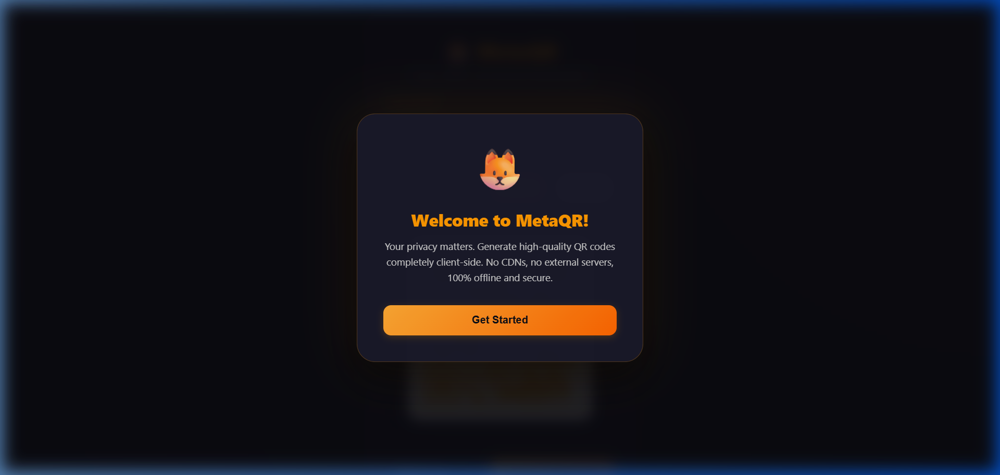

# 🦊 MetaQR - Offline QR Code Generator

MetaQR is a premium, MetaMask-inspired offline QR Code Generator. Built using pure vanilla web languages, it executes mathematical QR matrix calculations entirely client-side. No CDNs, no remote APIs, and no backend dependencies are used. Your data never leaves your computer, ensuring 100% privacy and security.

---

## 🎨 Visual Preview

### Welcome Greeting Modal


### Custom Generator Workspace (Landscape View)


---

## 🚀 Features

- **🔐 100% Local Privacy** – Generates QR codes offline in the browser. Zero network requests or external CDNs.
- **🎨 Custom Styling & Colors** – Adjust Foreground and Background colors using native color pickers with a live-updating canvas.
- **📐 Interactive Size Adjuster** – Fine-tune output dimensions in real time (supports high-resolution outputs up to 1000px).
- **💾 Premium File Exports**:
  - **PNG / JPEG**: Direct binary downloads.
  - **PDF Export**: Triggers specialized print-styles (`@media print`) that isolate and center the high-definition canvas, allowing you to print or save the QR code as a clean single-page PDF document.
- **🦊 Sleek Crypto UI** – Modern MetaMask-inspired dark palette layout, glassmorphic blur effects, hover glows, and responsive layout.
- **⚡ Real-Time Render** – Redraws the QR canvas dynamically as you type or change configurations.
- **👋 Welcome Popup Modal** – Greets users on their first load with an animation (dismissed state is persisted in `localStorage`).

---

## 🔧 How It Works

1. Open the application. You are welcomed by the introductory pop-up.
2. Enter text or paste a URL in the input field.
3. Configure the output size (px), foreground color, and background color. The QR canvas updates **instantly** in real time.
4. Select your preferred output format (`PNG`, `JPEG`, or `PDF`) from the dropdown.
5. Click **"Download QR Code"** to save your files locally.

---

## 🛠️ Tech Stack

- **HTML5** – Structured semantic elements & Canvas element for local rendering.
- **CSS3** – Styled with a dark glassmorphic grid system, custom animations, and native print media query overrides.
- **JavaScript (ES6)** – Application state binding, event listeners, and download link injection.
- **QRious Library** – A compact (approx. 5KB) client-side dependency included locally in [qrious.min.js](qrious.min.js) for drawing QR vectors on HTML5 Canvas.

---

## 📂 Project Structure

```bash
METAQR-GEN/
├── index.html       # Main application layout and modal controls
├── style.css        # MetaMask colors, animations, grid system, & print query overrides
├── script.js        # Event listeners, dynamic updates, modal & download triggers
├── qrious.min.js    # Local offline QR-generation library
└── screenshots/     # Application visual preview screenshots
    ├── welcome_modal.png
    └── final_ui_state.png
```
